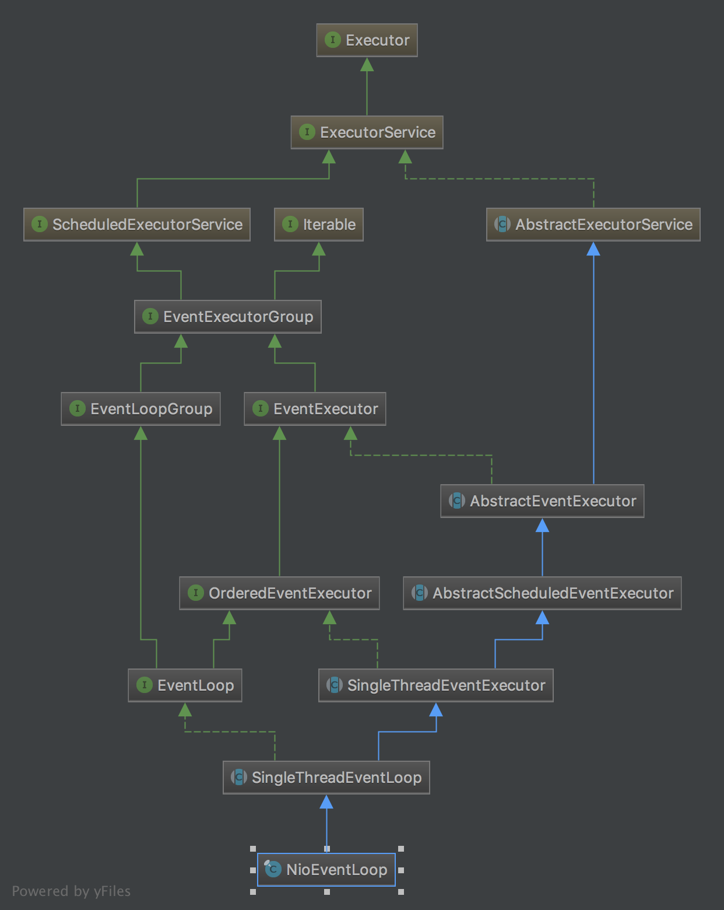
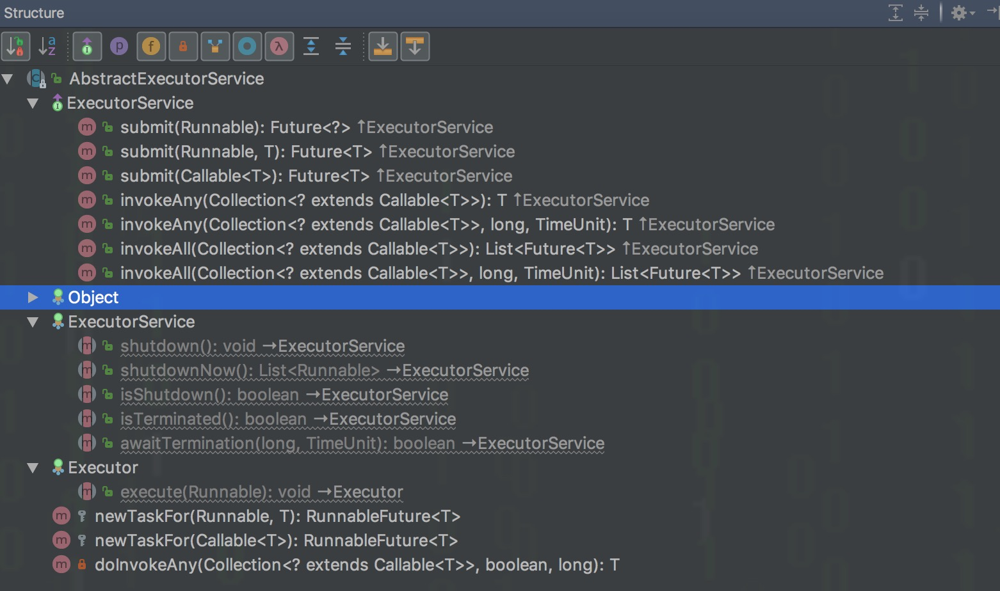
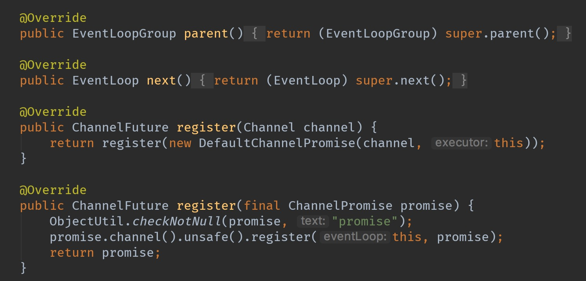

先放出`NioEventLoop`在netty4.0中的继承结构



我们可以看到继承结构还是比较深入的，为了理解TA具体承担了哪些职责，我们从最顶部的接口开始，层层推进

## Executor

```java
public interface Executor {
    void execute(Runnable command);
}
```

该接口为jdk接口，实现了这个接口的类具有执行task的功能，具体是在哪个线程中执行要看子类的实现,有的
直接在当前线程中执行，有的在线程池，有的另外new一个线程

## ExecutorService

继承自`Executor`，除了带有执行任务的功能之外，还具有管理任务的功能，管理一个任务列表，具体功能可以分为以下几类
- 提交任务
- 执行任务，包括执行所有或者执行任意一个，可以指定超时时间
- 关闭任务，强制关闭当前正在执行的任务，不接受新的任务，不执行正在排队中的任务
- 查询任务状态

## ScheduledExecutorService
除了包含`ExecutorService`的任务管理的功能外，该接口还具有定时执行任务的功能，具体包括

- 某个时间之后执行任务
- 以固定的频率执行任务

以上两种类型的定时方式都可以添加一个额外参数，initialDelay，这个参数的作用就是在定时执行之前等待多长时间

## EventExecutorGroup
事件执行器组，继承自`ScheduledExecutorService`说明TA有执行任务，管理任务，定时执行任务的能力，
继承`Iterable<EventExecutor>`，说明他是一类`EventExecutor`的集合
除了继承而来的功能，TA还新添了如下功能

- 优雅的关闭。前面提到`ExecutorService`关闭任务的方式是简单粗暴的，就算一个任务正在很happy的执行着，照样给你interrupt掉，而netty不希望这么做，
netty的做法是关闭之前等待一段时间，如果这段时间内还有任务提交，那么就重置这个等待时间，直到在等待时间内没有新的任务提交了，TA才开始关闭任务
- 状态，包括是否正在关闭或者给掉用方一个future，关闭的时候调用方会收到通知
- 找到该事件执行器组的一个事件执行器

## EventExecutor
事件执行器，继承自`EventExecutorGroup`说明TA有执行任务，管理任务，定时执行任务以及优雅关闭任务等功能，除了这些功能，TA还添加了如下功能

- 找到TA的时间执行器组
- 判断这个事件执行器从属线程是否和某个线程相同。有个快捷的方法可以判断当前线程是否是事件执行器从属的线程，netty里面用了大量的判断，
使得事件执行器的状态修改都在事件执行器里面执行，就可以避免线程同步，提高效率。

其他接口一般用不着，这里就不讲解了。

## OrderedEventExecutor
标记接口，标记事件执行器会按顺序执行任务

## EventLoopGroup
事件循环组，继承自`EventExecutorGroup`说明TA有执行任务，管理任务，定时执行任务以及优雅关闭任务等功能，除了这些功能，TA还添加了如下功能
- 返回一个事件循环组，一个事件循环组可以理解为一组线程，每个线程不停得轮训是否有IO事件或者有任务需要执行，一个事件循环`EventLoop`表示其中的一个线程
- 将一个`Channel`注册到该时间循环组上，`Channel`是netty里面的概念，是网络的抽象，后面`Channel`这一章节会详细分析

典型代码片段
```java
public interface EventLoopGroup extends EventExecutorGroup {
    EventLoop next();
    
    ChannelFuture register(Channel channel);
}
```

## EventLoop
事件循环器，用于执行绑定在TA上面的`Channel`的IO操作，该接口方法只有一个，就是返回他所属的事件循环组

## AbstractExecutorService
该类实现了提交任务的功能，包括指定所有的，以及随意执行一个, 如下图，至于关闭执行器，判断是否关闭，以及等待关闭，具体执行任务，TA都没有具体实现
但是TA提供了如何将一个`Runnable`包装成一个task的接口给子类，子类可以覆盖该方法,由于该类是jdk中的接口，所以不过多介绍


## AbstractEventExectutor
该类实现了事件执行器`EventExecutor`的功能，这里不详细介绍

## AbstractScheduledEventExecutor
支持定时执行任务的事件执行器

## SingleThreadEventExecutor
将所有的任务都丢到一个单线程中处理，定时任务也是在同一个线程中处理

## SingleThreadEventLoop

继承实现了 `EventLoop` 具有的功能，既然是事件循环，那么就应该具有事件循环标志的方法


可以看到，之所以叫事件循环，有标志性的函数，就是注册channel，那么后续的所有该channel的读写连接断开等事件，该事件循环期都可以检测到并且处理


以上就是`NioEventLoop`实现的所有的接口以及父类，我们总结一下`NioEventLoop`至少具有的功能
- 提交任务执行
- 定时执行任务
- 管理任务，管理任务状态等等
- 注册IO抽象`channel`,执行在该`channel`上的IO操作
- 多路复用轮训，传播事件


